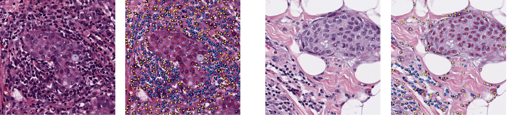

# TCGA Breast Cancer Cell Classification Dataset #
This dataset accompanies our paper "Multi-Class Cell Detection Using Spatial Context Representation", ICCV 2021. See citation at the end.

 

This dataset provides dot annotations for multi-class cell classification in breast cancer images. The cell classes are lymphocytes (blue), tumor or epithelial cells (red), and stromal cells (yellow). 

## Images ##
The images are patches from the TCGA dataset (The Cancer Genome Atlas.
https://tcga-data.nci.nih.gov/docs/publications/tcga). 
The patches are located in 'images' folder.
They are extracted from 1000x1000 pixels at highest resolution and downsampled to 20x. All images are around 500x500 pixels. There may be slight variations in image size due to variations in the original slides resolution. 

## Data Splits ##
The training, validation, and test splits are in the files: 
brca\_ds\_train.txt 
brca\_ds\_val.txt 
brca\_ds\_test.txt 

## Label files ##
The ground truth labels are in the 'labels' folder.    
### Label files format: ###
 
- Each file name is prefixed with the corresponding image filename. 
- Each row in a label file has the following format: 
< Y coordinate > < X coordinate > < cell class ID > 
- The cell class IDs are: 
1 = Lymphocytes, 2= Tumor/Epithelial, 3=Stromal cells.

**Read labels:** The file read\_labels.py provides a sample python implementation to read the label files and visualization them.

**Get Splits Statistics:**  The file get\_data\_stats.py computes number of cells in each class per train/validation/test split.

## Data Visualization ##
The folder 'images\_with\_labels' contains a visualization of the labels in the form of colored dots overlayed on the patch images with the following color code:   (Blue = Lymphocyte, Red = Tumor/Epithelial, and Yellow = Stromal cells). 

## Citation ##

	@inproceedings{abousamra2021MCSpatNet,
	author      =  {Shahira Abousamra, David Belinsky, John Van Arnam, Felicia Allard, Eric Yee, Rajarsi Gupta, Tahsin Kurc, Dimitris Samaras, Joel Saltz, Chao Chen},
	title       =  {Multi-Class Cell Detection Using Spatial Context Representation},
	booktitle   =  {International Conference on Computer Vision (ICCV)},
	year        =  {2021}}

 
